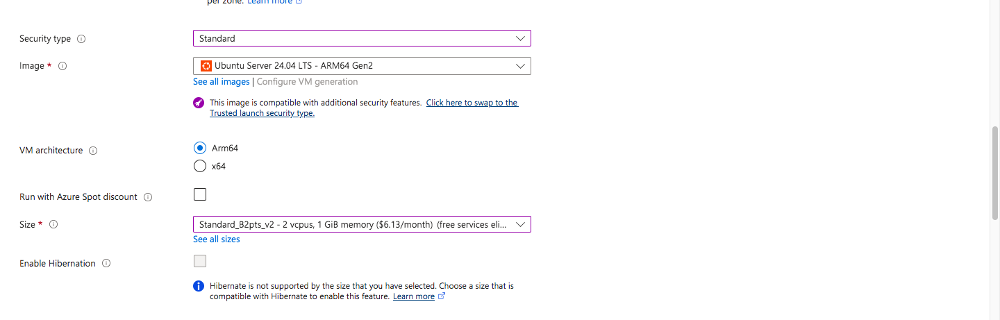
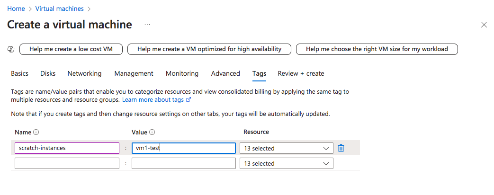
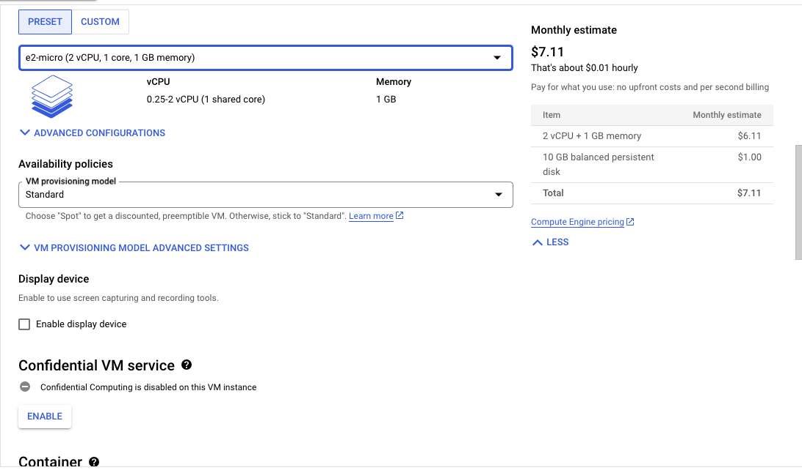

# HHA504_assignment_vms

## 1. Start and Stop a Virtual Machine
### Azure - Steps I Took
 1. Starting with Basics tab
     1. Clicked "Virtual Machine"
     2. Clicked "+Create," then "Azure virtual machine"
     3. Clicked "HHA-504" as Resource group
     4. Gave VM a name
     5. Changed security type to "Standard"
     6. Changed VM architecture to Arm64
     7. Chose "Standard_B2pts_v2 - 2 vcpus, 1 GiB memory ($6.13/month)" as the size
     8. Changed the authentication type to "password" and created a username and password

 2. In Disks tab
     1. Changed OS disk type to standard SSD

 3. In Networking
     1. Deselected "Enable accelerated networking"

 4. In Tags
     1. Created one tag called "scratch-instances" with a value of "vm1-test"

 5. In Review + Create
     1. Checked the price, which came out to be 0.0084 hourly
     2. Clicked "Create"

6. VM was ran for 15 minutes, then stopped and deleted after 
7. Cost did not immediately appear, so it was checked the following day. The total cost mentioned was <$0.01, but not the exact cost.
### GCP - Steps I Took
 1. Clicked "Compute Engine" 
 2. Clicked "Create Instance"
 3. Changed the regions to us-east1(South Carolina) and us-east4(Northern Virginia) to see which was cheaper; us-east1 was cheaper, but was also the same as the default region of us-central1(Iowa).
 4. Ultimately chose us-central1(Iowa) as it is low CO2
 5. Changed the machine type to e2-micro, resulting in a cheaper price
 6. Created the VM with a final price of $7.11 (0.01 hourly)
 7. VM was ran for 15 minutes, then stopped
 8. Deleted VM about 2 hours later, after learning in class that same day that simply stopping a VM does not stop cost from incurring

## 2. Monitor VM Costs
In both platforms, the cost did not appear immediately after stopping the VM, but appeared the next day instead. Total cost is shown below:
### Azure: <$0.01 (the exact amount not specified)

### GCP: $0.02

## 3. Compare and Reflect
The cost of GCP's VM turned out much higher than Azure's VM although both were ran for 15 minutes and configured with minimizing cost in mind. I believe the most likely reason for this is because I did not delete GCP's VM right after I stopped it.

I was not aware that costs continue to accrue for a stopped VM until I learned about it in class later that same day. Thus, I ended up deleting GCP's VM two hours after I had stopped it. I created Azure's VM some time after that class, so I knew to delete it immediately after stopping it. However, even if I deleted GCP's VM right after I stopped it, I believe its cost would have still been higher since the cost of running GCP's VM was $0.01/hr while Azure was $0.0084/hr.

In terms of creating a VM, I found GCP to be significantly more user-friendly than Azure. GCP's VM can be created in a single page unlike Azure where the user has to go through many different configuration tabs. However, I believe GCP and Azure are equally user-friendly in stopping and monitoring the VM. For both, getting to the page to stop the VM and finding the stop button did not require too much navigating. The same applied to getting to the cost page too.

Overall, I feel GCP is much more user-friendly because there is less options to go through to make the VM. 
